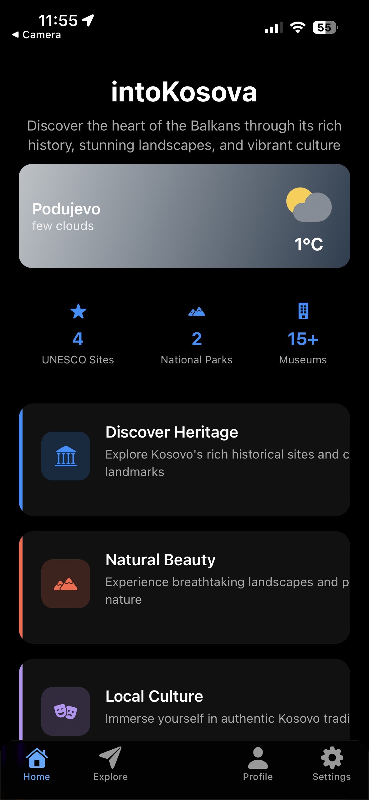
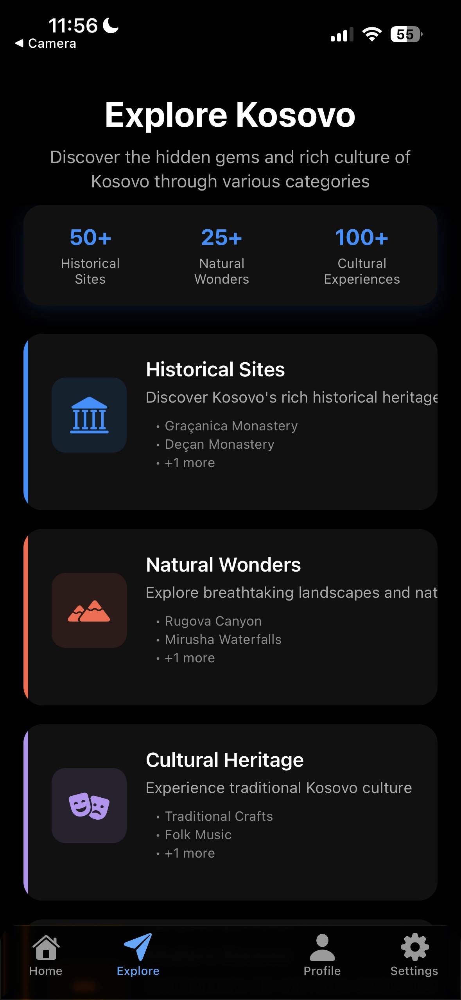
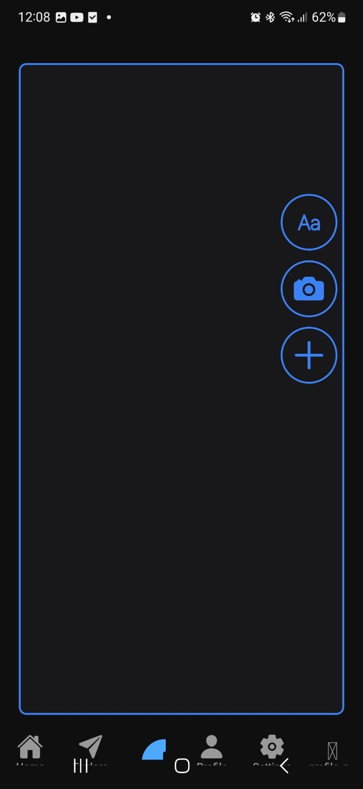
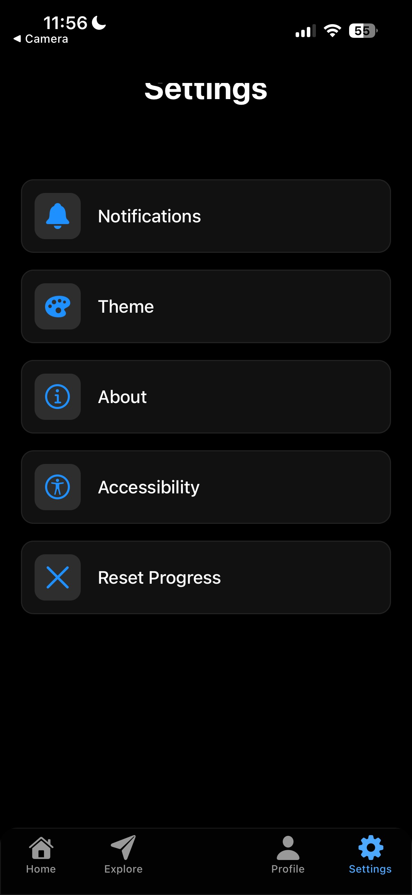
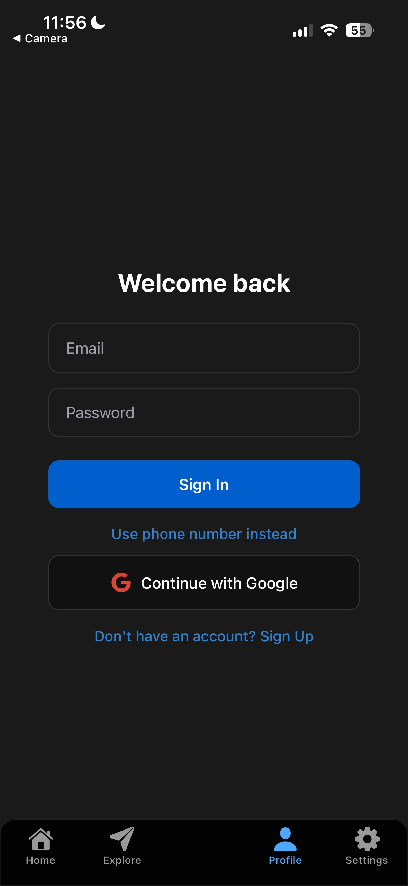

# intoKosova

## About the Project
intoKosova is a mobile application developed using **React Native (Expo)** that presents the cultural heritage, natural beauty, and modern lifestyle of Kosovo in a simple and interactive way.

The application serves as a digital guide for locals, tourists, and anyone interested in discovering Kosovo through a modern and immersive mobile experience.

**Main Features**
- Discover historical and cultural landmarks
- Explore natural parks and scenic landscapes
- Experience modern life and traditions in Kosovo
- Clean, modern, and user-friendly interface
- Smooth animations and intuitive navigation

---

## Architecture Overview

### Frontend (Mobile App)
- Built with **React Native** and **Expo**  
- Navigation handled with **Expo Router** for structured and scalable routing  
- **React Native Reanimated** for smooth animations and user interactions  
- **Expo Glass Effect** and **SafeAreaView** for accessibility and modern UI  
- Custom-built components and icons for a personalized interface  

### Data & Content
- Dynamic data for categories such as *Historical Sites*, *Natural Wonders*, and *Modern Attractions*  
- Interactive UI elements to browse destinations, descriptions, and visuals  

---

## Setup and Use

To run this project on your local machine, ensure you have installed:
- **Node.js** (with npm or yarn)
- **Expo CLI** globally

### Installation

Clone the repository:
```bash
git clone https://github.com/<your-username>/intoKosova.git
cd intoKosova

Install dependencies:

npm install


Run the development server:

npx expo start


Scan the QR code in the terminal or browser using the Expo Go app on your phone to view the app.
```

## Technologies Used
Area	Technology
Framework	React Native / Expo
Navigation	Expo Router
Animations	React Native Reanimated
UI Design	Expo Glass Effect, SafeAreaView
Components	Custom-built reusable UI elements
Purpose

This project aims to create an educational and tourism-focused mobile app that highlights Kosovo’s identity, beauty, and diversity using modern technology and clean design.
It serves as a digital guide for locals, tourists, and anyone interested in learning more about Kosovo.
The project also emphasizes teamwork, user-centered design, and innovation in mobile development.

## Testing
In this project, automated tests have been implemented to ensure the stability and reliability of the core user-facing features. The test suite includes snapshot tests to verify that key screens and components render consistently over time, interaction tests to validate user behavior such as button presses, form input validation, modal visibility, and authentication flows, and mocking tests to isolate the application logic from external dependencies. Firebase authentication, navigation, storage, and Expo native modules are mocked to allow predictable and fast test execution without relying on real backend services or device-specific APIs. Together, these tests help prevent regressions, ensure correct user interactions, and maintain a stable and maintainable codebase.

```bash
npm test
```

## Application Screenshots

<table>
  <tr>
    <td align="center">
      
    </td>
    <td align="center">
      
    </td>
    <td align="center">
      
    </td>
    <td align="center">
      
    </td>
    <td align="center">
      
    </td>
    <td align="center">
      
    </td>
  </tr>
</table>


## Team — intoKosova

Amat Raçi

Anis Millaku

Diella Kika

Diellart Mulolli

Erisa Ramadani

Shpetim Panduri
